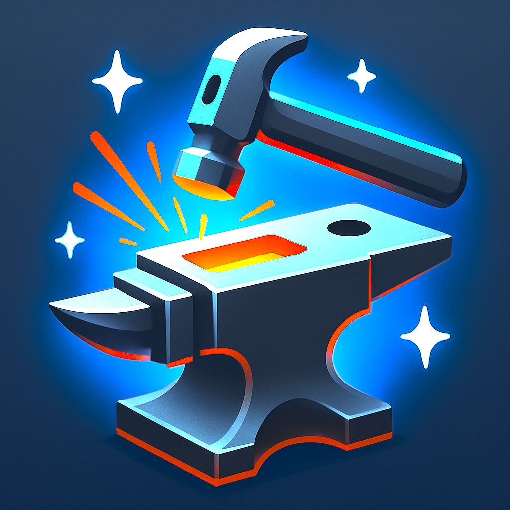

# StreakForge Support

  

  <strong>Support Resources for StreakForge</strong>

---

## Contact Support

**Email**: [StreakForge@rfanimationllc.com](mailto:StreakForge@rfanimationllc.com)

When contacting support, please include:
- App version (found in Settings)
- Device model and iOS version
- Description of the issue
- Screenshots if applicable

---

## Frequently Asked Questions

### General

**Q: What's the difference between Actions and Behaviors?**

**Actions** are daily recurring habits you want to build (exercise, meditate, read). They track streaks and show completion status each day.

**Behaviors** are one-time events you want to log and monitor over time (headaches, positive achievements, any occurrence). They don't have streaks but show frequency and patterns.

---

**Q: How do streaks work?**

Your streak counts consecutive days you've completed an action. The streak increases each day you complete the action and resets if you miss a day (unless you have streak recovery enabled).

---

**Q: What is Streak Recovery?**

Streak Recovery gives you a grace period when you miss a day. Instead of immediately losing your streak, you have a configurable window to "recover" and continue your streak. This helps prevent frustration from occasional missed days.

---

**Q: What are Freeze Days?**

Freeze Days let you pause streak tracking for planned breaks (vacations, illness, etc.). Your streak won't be affected during frozen days.

---

### Data & Sync

**Q: How do I sync between devices?**

Enable iCloud sync in Settings. Your data will automatically sync between all your Apple devices signed into the same iCloud account.

---

**Q: How do I backup my data?**

Go to Settings > Export Data. This creates a CSV file with all your actions, behaviors, and historical logs that you can save anywhere.

---

**Q: How do I restore from a backup?**

Go to Settings > Import from Backup and select your previously exported CSV file.

---

**Q: Is my data secure?**

Yes. All data is stored locally on your device. If you enable iCloud sync, your data is encrypted and only syncs between your own devices using Apple's secure CloudKit service.

---

### Widgets & Watch

**Q: How do I add widgets?**

Long-press on your home screen, tap the + button, search for StreakForge, and choose your preferred widget size.

---

**Q: How do I use the Apple Watch app?**

The StreakForge Watch app automatically installs when you install the iPhone app (if you have an Apple Watch paired). Open it to quickly log actions from your wrist.

---

## Resources

- **Privacy Policy**: [PRIVACY_POLICY.md](PRIVACY_POLICY.md)
- **Marketing Site**: [github.com/rfanimation/streakforge-site](https://github.com/rfanimation/streakforge-site)
- **App Store**: [Download StreakForge](https://apps.apple.com/app/streakforge/id6739812123)

---

## About

StreakForge is developed by [RF Animation LLC](https://www.rfanimationllc.com).

© 2025 RF Animation LLC. All rights reserved.
